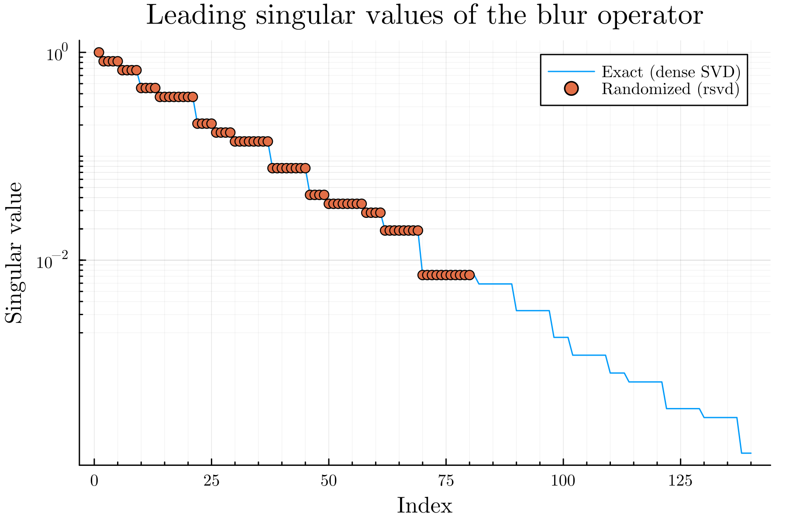

# MatrixFreeRandomizedLinearAlgebra.jl

[](https://paulvirally.github.io/MatrixFreeRandomizedLinearAlgebra.jl/stable)
[](https://paulvirally.github.io/MatrixFreeRandomizedLinearAlgebra.jl/dev)
[](https://github.com/PaulVirally/MatrixFreeRandomizedLinearAlgebra.jl/actions/workflows/ci.yml)
[](https://codecov.io/gh/PaulVirally/MatrixFreeRandomizedLinearAlgebra.jl)
[](https://github.com/JuliaTesting/Aqua.jl)
[](https://juliahub.com/ui/Packages/General/MatrixFreeRandomizedLinearAlgebra)
[](LICENSE)

Randomized algorithms for the top singular values, eigenvalues, and the trace of
a linear operator, without building the matrix.

If you can multiply your operator by a vector (and, for some of these, by its
adjoint), you can use it here: dense or sparse matrices, GPU arrays,
[`LinearMaps.jl`](https://github.com/JuliaLinearAlgebra/LinearMaps.jl) operators,
or any type that defines `size` and `*`. The methods are randomized
approximations from Halko, Martinsson, and Tropp. They are most useful when the
operator is large, a matrix-vector product is cheap, and you only need a low-rank
piece of it, which is the case where a full dense factorization is too slow or
doesn't fit in memory.

<p align="center">
  
  
</p>

Left: time to compute the leading singular values of a matrix-free 2D blur
operator, dense versus this package. Right: the values it returns sit on top of
the exact spectrum. Both plots come from the scripts in [`examples/`](examples).

## What's here

- `rsvd` / `rsvdvals`: randomized SVD and singular values for general (possibly
  rectangular) operators.
- `reigen_hermitian` / `reigvals_hermitian`: randomized eigendecomposition and
  eigenvalues for Hermitian operators.
- `trace`: stochastic trace estimation. XTrace by default, or a streaming
  Hutchinson estimator when memory is tight.

All of it runs on CPU or GPU arrays, and the decomposition routines take a
`seed_Q` keyword if you already have a basis to start from.

## Installation

```julia
] add MatrixFreeRandomizedLinearAlgebra
```

## Quick example

```julia
using MatrixFreeRandomizedLinearAlgebra, LinearAlgebra

A = randn(100, 50)            # any operator with size, *, and '
U, S, Vt = rsvd(A, 10)        # rank-10 randomized SVD
rel = opnorm(A - U * Diagonal(S) * Vt) / opnorm(A)
println("relative error: ", rel)
```

## Very large operators

The operator is matrix-free, but the `N × (k + p)` sketch is not: at `N = 10⁷`
and `k + p = 1000` it is 160 GB of `ComplexF64`, which no GPU will hold. Every
routine accepts a [Funicular.jl](https://github.com/PaulVirally/Funicular.jl)
`ResidencyPlan` through the `plan` keyword. Given one, the sketch is streamed
through the device in column panels and spills to pinned host memory and to
disk, and the random test matrix is regenerated on demand rather than stored.

```julia
using CUDA, Funicular, MatrixFreeRandomizedLinearAlgebra

plan = ResidencyPlan(backend = Funicular.cuda_backend(),
                     device_budget = 0.8 * CUDA.total_memory(),
                     host_budget = 192 * 2^30,
                     scratch_dir = "/scratch/me/funicular")

E = reigen_hermitian(G, 512; num_oversamples=64, plan=plan, seed=1)
E.values                    # host Vector of eigenvalues
E.vectors                   # N × 512 Funicular PanelMatrix
```

See [Very large operators](https://paulvirally.github.io/MatrixFreeRandomizedLinearAlgebra.jl/stable/large_operators/)
for the operator contract, the sweep-counting cost model, and when not to use
this.

## Learn more

- [Documentation](https://paulvirally.github.io/MatrixFreeRandomizedLinearAlgebra.jl/stable):
  what matrix-free means, how the algorithms work, and the API reference.
- [`examples/`](examples): runnable scripts that compare accuracy and runtime
  against dense references. They generate the plots above.
