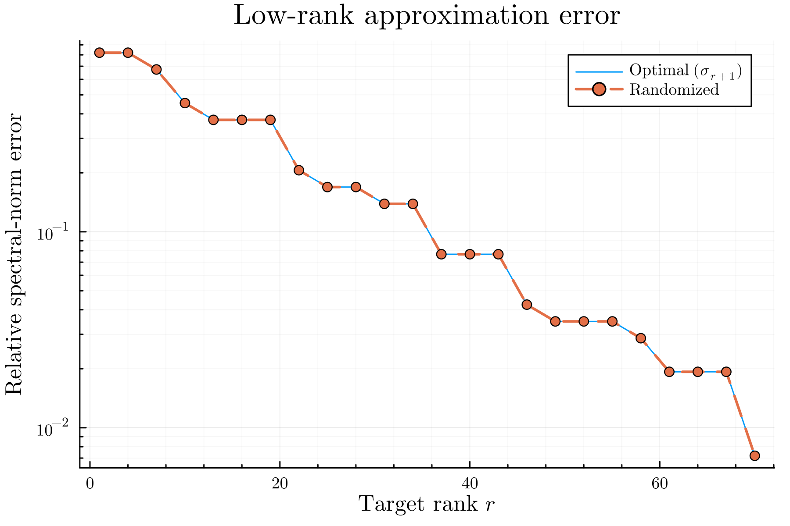
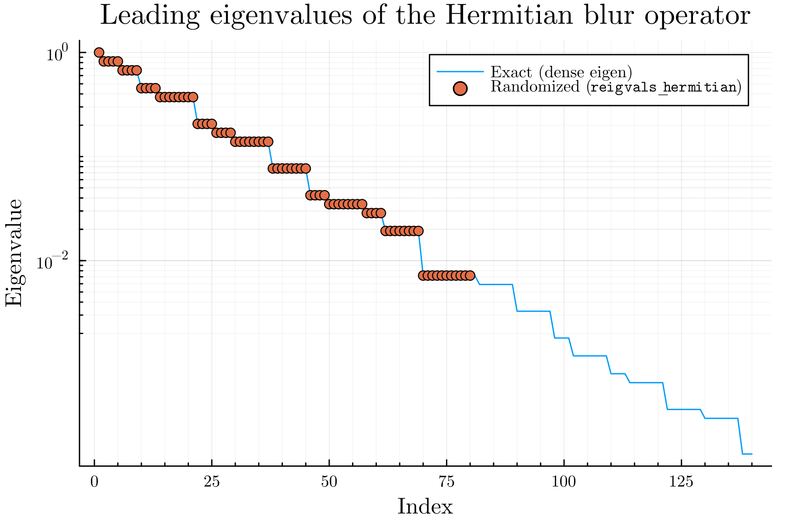
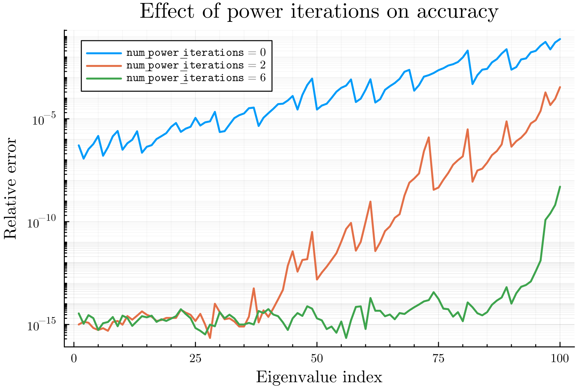
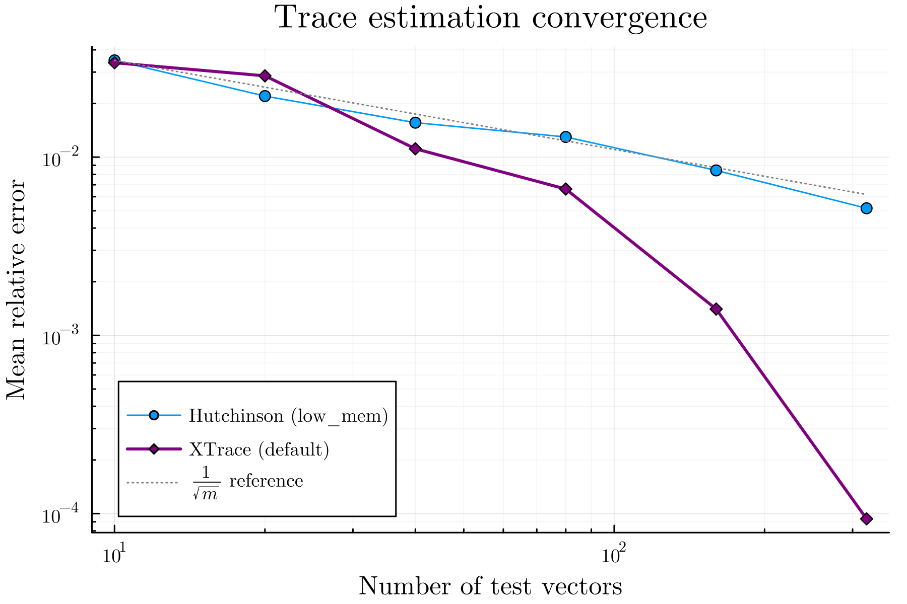

# Examples

The [`examples/`](https://github.com/PaulVirally/MatrixFreeRandomizedLinearAlgebra.jl/tree/main/examples)
directory has runnable scripts that produce the figures below. They all use the
same toy operator, a matrix-free 2D periodic Gaussian blur built from FFTs (see
[What "matrix-free" means](@ref)). The matrix it stands for is `n² × n²` and is
never formed, except for a small dense reference used for comparison.

To run them:

```sh
julia --project=examples examples/01_rsvd_blur.jl
julia --project=examples examples/02_reigen_hermitian.jl
julia --project=examples examples/03_trace.jl
julia --project=examples examples/04_performance.jl
```

The shared operator is in
[`examples/operators.jl`](https://github.com/PaulVirally/MatrixFreeRandomizedLinearAlgebra.jl/tree/main/examples/operators.jl):

```julia
# A matrix-free blur: forward and adjoint are each two FFTs.
function blur_operator(n; sigma = n / 16, shift = (0, 0))
    khat = fft(gaussian_psf(n; sigma = sigma, shift = shift))   # transfer function
    N = n * n
    fwd(x) = vec(real(ifft(khat .* fft(reshape(x, n, n)))))
    adj(y) = vec(real(ifft(conj.(khat) .* fft(reshape(y, n, n)))))
    return LinearMap{Float64}(fwd, adj, N, N)
end
```

## Randomized SVD

`examples/01_rsvd_blur.jl` runs [`rsvd`](@ref) on a slightly asymmetric blur
operator and compares against a dense `svd`. The recovered singular values land
right on the exact spectrum, and the rank-`r` approximation error stays close to
the optimal `σᵣ₊₁`.

```julia
A = blur_operator(n; sigma = n / 10, shift = (1, 0))
F = rsvd(A, k; num_oversamples = 40, num_power_iterations = 8, sample_vec = Float64[])
# F.U * Diagonal(F.S) * F.Vt ≈ A
```




## Randomized Hermitian eigenvalues

`examples/02_reigen_hermitian.jl` uses the symmetric (zero-shift) blur, which is
Hermitian positive semidefinite, and recovers its leading eigenvalues with
[`reigvals_hermitian`](@ref), comparing against a dense `eigvals`.

```julia
A = blur_operator(n; sigma = n / 10) # Hermitian PSD
λ = reigvals_hermitian(A, k; num_oversamples = 40, num_power_iterations = 8, sample_vec = Float64[])
```



The second figure shows the accuracy knob at work. With no power iteration the
leading eigenvalues are already reasonable, but the estimates get worse toward the
truncation rank. A few power iterations pull the whole curve down close to machine
precision, at the cost of extra passes over the operator.



## Trace estimation

`examples/03_trace.jl` estimates `tr(A)` with both estimators and plots their
relative error against the number of test vectors, averaged over many trials.
XTrace's leave-one-out correction lets it drop well below the `1/√m` rate that
the streaming Hutchinson estimator follows.

```julia
A = blur_operator(n; sigma = n / 20)
t  = trace(A, 100; sample_vec = Float64[]) # XTrace, fixed budget
t2 = trace(A, 100; low_mem = true, sample_vec = Float64[]) # streaming Hutchinson
res = trace(A; relative_tolerance = 1e-2, return_error = true, sample_vec = Float64[])
```



## Performance vs a dense factorization

`examples/04_performance.jl` times recovering the leading singular values two
ways: materialize the operator and call dense `svdvals`, or call
[`rsvdvals`](@ref) on the matrix-free operator. The dense route is cubic in the
operator dimension and needs the whole matrix in memory, so it only runs for the
smaller sizes. The matrix-free route keeps going well past the point where
forming the matrix stops being practical.


This is the situation the package is for. When the operator is large and you only
want a few components, working through matrix-vector products instead of a dense
factorization is what keeps the problem tractable.
