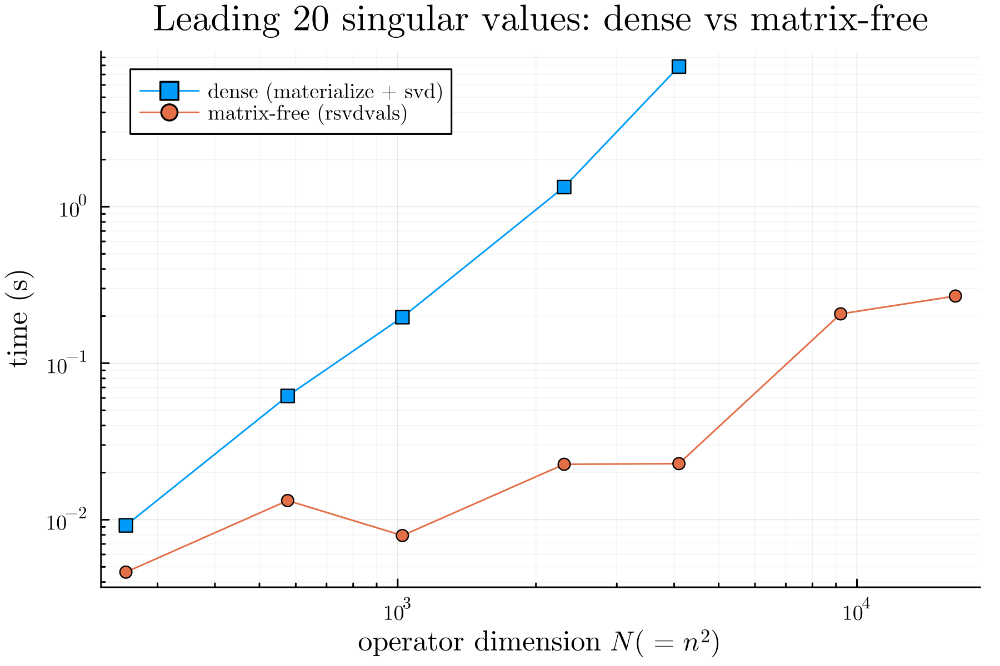

# MatrixFreeRandomizedLinearAlgebra.jl

Randomized algorithms for the top singular values, eigenvalues, and the trace of
a large linear operator, without building the matrix. If you can apply your
operator to a vector (and, for some routines, its adjoint), these routines work
on it: dense and sparse matrices, GPU arrays, `LinearMaps.jl` operators, or
anything else that defines `size` and `*`.

These are approximate, randomized methods of the kind described by Halko,
Martinsson, and Tropp. They are most useful when the operator is large, a
matrix-vector product is cheap, and you only want a low-rank piece of it. That is
the case where a dense factorization is too slow or won't fit in memory.



## What's here

- [`rsvd`](@ref) / [`rsvdvals`](@ref): randomized SVD and singular values for
  general (possibly rectangular) operators.
- [`reigen_hermitian`](@ref) / [`reigvals_hermitian`](@ref): randomized
  eigendecomposition and eigenvalues for Hermitian operators.
- [`trace`](@ref): stochastic trace estimation. XTrace by default, or a streaming
  Hutchinson estimator when memory is tight.

Everything runs on CPU or GPU arrays.

## Installation

```julia
] add MatrixFreeRandomizedLinearAlgebra
```

## Quick start

```julia
using MatrixFreeRandomizedLinearAlgebra, LinearAlgebra

A = randn(100, 50)            # any operator with size, *, and '
U, S, Vt = rsvd(A, 10)        # rank-10 randomized SVD
rel = opnorm(A - U * Diagonal(S) * Vt) / opnorm(A)
println("relative error: ", rel)
```

## Where to next

- [What "matrix-free" means](@ref): the idea, and where matrix-free operators
  come from in Julia.
- [Algorithms](@ref): how each routine works.
- [Examples](@ref): worked examples with accuracy and performance comparisons.
- [API Reference](@ref): the full docstrings.
- [References](@ref): the papers these implementations come from.
